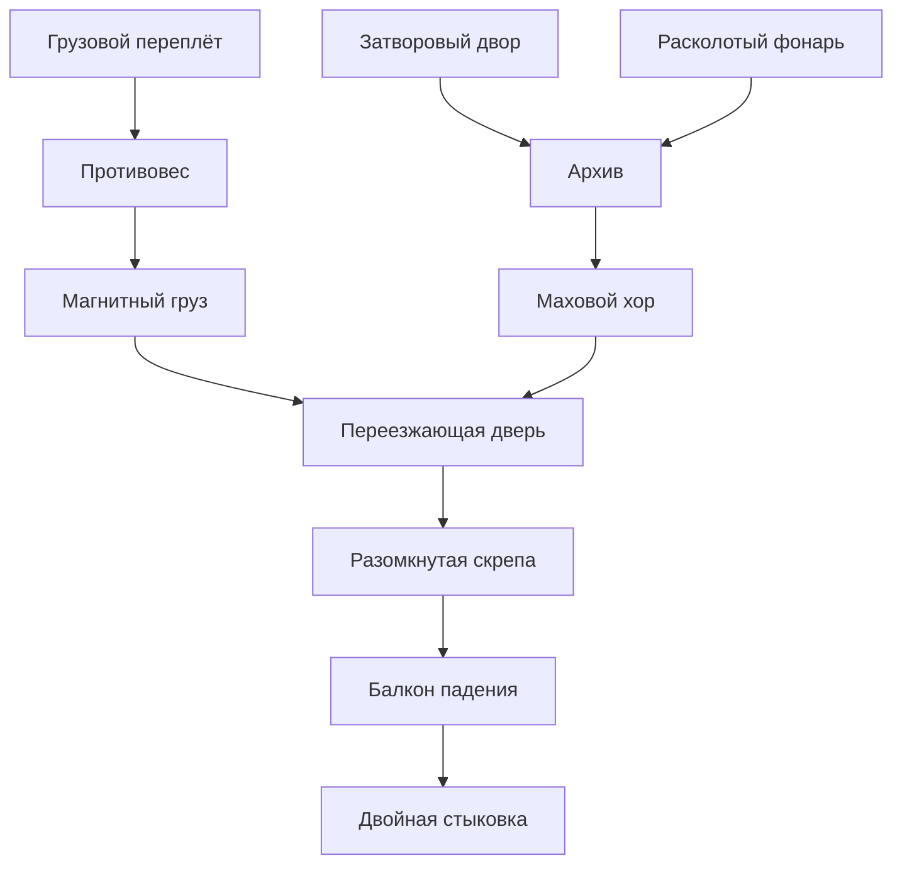

# Кампания v48: изменения и внутренняя приёмка

Срез на 4 октября 2026 года, редакция `foundation`, кандидат `v48-folded-castle`.
В кампании остаётся **41 уровень**. Этот документ фиксирует реализованную работу
и условия выпуска; он не заменяет отчёт проверки окончательного commit и ZIP.
Локальные результаты ниже — свидетельства отдельных проверок. Окончательные SHA,
успешный CI и запись опубликованного прохождения должны относиться к одному
неизменному кандидату; выпуск закрепляет их в конфигурации и README.

## Что изменено

Полностью заменены задачи **31/32/33/34/36/37/39/40/41**. Различие механик
оценивается по источнику энергии, геометрии и причинным связям, а не по цвету
или числу одинаковых остановок. Исходный облик игрока, спутника и оружия сохранён.

| Уровень | Новая задача | Что игрок должен обнаружить |
|---:|---|---|
| 31 | Грузовой рейк | Воздух двигает настоящий груз; его контакт двигает рейку и мост. Один воздух работу не выполняет. |
| 32 | Тонкая тень | Реальный непрозрачный корпус затеняет нижний луч, сохраняя верхний. Важны размер и положение тела. |
| 33 | Обратная пружина | Человек заранее заряжает пружину своим весом; зажим хранит деформацию до загрузки и запуска друга. |
| 34 | Пневмоаккумулятор | Груз закрывает утечку. Накопленное давление открывает дверь и затем освобождает собственную пробку; обратный тракт возвращает груз. |
| 36 | Удар по касательной | Падение через портал даёт настоящий удар по плечу барабана. Осевой удар не заменяет момент вращения. |
| 37 | Магнитный обход | Свободный друг проходит низкий изогнутый канал силами катушек; у человека отдельная галерея. |
| 39 | Тепловая память | Перенос луча к дальней двери прекращает нагрев первого штока. Запас тепла непрерывно расходуется. |
| 40 | Дифференциальный калибратор | Плечо груза сдвигает окна противоположно, общая регулировка — вместе. Луч должен пройти настоящие щели. |
| 41 | Складчатый замок | Один связанный многоэтажный маршрут объединяет 11 разных механизмов, одну пару порталов и одного исходного друга. |

В **16 «Ложный пол»** закрыт подтверждённый обход: удалены независимая грузовая
площадка, её опоры и панели прямой подачи в колодец. Теперь исчезновение световой
опоры вызывает настоящее падение друга и нагружает противовес. Порядок действий
не контролируется скрытым сенсором; обязательность обеспечивает видимая геометрия.

Подробные границы оригинальности и обходов: [аудит 1–20](AUDIT_EARLY_ROOMS_RU.md)
и [аудит 21–40](AUDIT_LATE_ROOMS_RU.md). Семьи 12/18 и 13/20 по-прежнему требуют
человеческого сравнения: локальный аудит различает их реальные связи, но не
доказывает, что человек воспринимает каждую задачу как новую.

## 41: пространство, механика и читаемость

Вместо прежнего набора 16 залов построен собственный замок вокруг общего
атриума. Пять основных отметок пола: **0, 18, 36, 54, 72** в координатах игры.
Галереи, четыре чередующихся лестничных пролёта, балконы и смещённые входы
возвращают игрока на разные стороны уже знакомого пространства. Внутри отдельных
крыльев есть дополнительные рабочие высоты. Список и зависимости заданы в
[LabSingularityLayout.js](../src/game/LabSingularityLayout.js).

| Узел | Основной пол | Физическая причина продвижения |
|---|---:|---|
| `freight` / Грузовой переплёт | 0 | Несущая перегородка со смотровым грузовым проёмом разделяет приёмники. Полноразмерная портальная пара переносит игрока с другом; самостоятельная отправка свободного друга проверяется отдельно. |
| `sluice` / Затворовый двор | 0 | Сохраняемый запас 10 распределяется между сосудами 10/7/3 до 5/5/0; водяной напор поднимает утопленный пролёт. |
| `optics` / Расколотый фонарь | 0 | Луч проходит портал и настоящий отражатель к приёмнику за перегородками. |
| `hoist` / Колодец противовеса | 0 → 18 | Вес друга поднимает клеть; верхний уловитель удерживает её, затем груз доставляется к верхнему контакту. |
| `archive` / Перекрёстный архив | 18 | Две реальные выдвижные секции меняют маршрут прохода. Геометрическая щека закрывает найденный обход с одной секцией. |
| `flywheel` / Маховой хор | 18 | Передача и муфта используют запас вращательной энергии; тормоз его расходует. |
| `magnet` / Подвешенный груз | 18 | Катушки проводят свободное тело через высокий грузовой проём к поднятому весовому приёмнику. Человек в проём не помещается. |
| `migrant` / Переезжающая дверь | 36 → 39 | Портальная рамка движется вместе с настоящей кареткой между разделёнными экраном берегами; перевозятся игрок и тот же друг. |
| `pendulum` / Разомкнутая скрепа | 36 → 42 | Два пролёта движутся в противофазе; до двух механических уловителей нужно добраться по самим пролётам. |
| `inertia` / Балкон падения | 54; старт падения 66 | Скорость набирается падением в колодец и переносится через боковой выход к нижнему дальнему балкону. |
| `crown` / Двойная стыковка | 72 | За второй несущей перегородкой требуются две самостоятельные нагрузки: свободный исходный друг в гнезде и человек на соседнем контакте. |

Граф ниже показывает непосредственные связи до вершины. Вход `crown` отдельно
проверяет питание от **всех десяти** предыдущих узлов; это видимый входной затвор.
Три начальных крыла доступны в разном порядке.

Архитектурный хаос остаётся читаемым благодаря постоянному атриуму, обзору
соседних этажей через настоящие застеклённые окна, разным силуэтам крыльев и
материалам. Белые керамические панели обозначают портальные поверхности.
Таблички затворов называют конкретные питающие комнаты и показывают состояния
«РАБОТАЕТ / ЖДЁТ»; длинная подсказка у вершины объясняет место возврата.
Лестничные вырезы оставляют настоящий запас над головой. Окна, стеновые кассеты,
нижние балки и направляющие согласованы с физической геометрией.

Детали следуют состоянию механизмов: канаты и противовес соединены с клетью,
приборы имеют стойки и кронштейны, сосуды — трубную обвязку, архив — кассеты
полного хода. Дерево, латунные вставки, штукатурка крыльев и тёплые потолки
построены процедурно без новых скачиваемых моделей. Декор не присваивает позиции,
скорости или прогресс акторов. Счётчики портальных пересечений и полёта являются
свидетельствами; завершение не подменяется условиями «когда-то нёс груз» или
«сделал нужное число порталов». Перезапуск сбрасывает весь замок, чекпоинтов нет.

## Общие условия приёмки

- **Физика и апертуры.** Вертикальная капсула человека должна помещаться в оба
  портала с фактическим смещением. Для свободного груза проверяются все восемь
  вершин повёрнутого корпуса на входе и выходе, включая позу в момент пересечения.
  Невмещающийся актор остаётся перед твёрдой подложкой. Защита контакта относится
  к конкретной портальной поверхности; соседние стены и края не отключаются.
  Движущийся портал использует рамку в настоящий момент пересечения.
- **Маршрут и учёт.** Полное прохождение выполняется движением, прыжком, E,
  стрельбой и переадресацией одной пары. Позиции, скорости, высоты механизмов и
  флаг победы не назначаются драйвером. Во всех 11 событиях фиксируется реальная
  причина; исходный объект друга и его rigid body сохраняются. Проверяемые
  координаты и скорости должны быть конечными, без NaN/Infinity.
- **Анимация и ввод.** Интеграция позы принимает полный кадр 15 FPS вместо прежнего
  отсечения времени до 0,05 секунды, сохраняя внутренние шаги до 240 Гц.
  Это исправляет временную согласованность; само по себе не является обещанием
  60 FPS на устройстве. Пауза должна останавливать управление, физику и звук.
- **Доступность и платформа.** Подсказки не перекрывают сенсорные кнопки, выход из
  рекламы не отменяет ручную паузу. Гостевая игра не требует аккаунта;
  завершённые комнаты и настройки сохраняются локально, облачной синхронизации
  нет. Внутреннее состояние замка не выдаётся за сохранённый чекпоинт.

## Свидетельства и оставшийся выпускной барьер

| Проверка | Последний локальный результат | Ограничение свидетельства |
|---|---|---|
| Ранние уровни 1–20 | 20 канонических маршрутов; 98 конечных атак | Последний полный запуск загрузил код до последних проверок принадлежности подложки в `LabGame.js`. Нужен повтор точного CI-кандидата. |
| Поздние уровни 21–40 | 20/20 маршрутов, 47/47 атак; 38/38 тестов | Конечная выборка обычных действий; подробности и SHA в [позднем аудите](AUDIT_LATE_ROOMS_RU.md). |
| Общее ядро | 18/18 стресс-проверок (`adversarial-core.json`); 8/8 контрольных маршрутов (`core-canonical-final.json`) | Начальные позы и импульсы стрессовых fixtures заданы явно. Это проверка контроллера, а не прохождение авторского уровня. |
| Замок 41 | 24/24 последних теста полного маршрута и коллизий после финальной проверки вершин груза; ещё 10 профильных проверок выполнены отдельно | Дополнительные проверки не выдаются за единый запуск на последнем core-срезе. Полный маршрут достигает всех 11 узлов с тем же другом, без reset/respawn/cargo reset. |
| Независимые атаки 41 | Замороженный срез: 16/16 PASS, 14 выполненных атак и две физически заблокированные подготовки, без смены исходных SHA (`castle-independent-frozen-release/report.json`) | Проверены лестницы к закрытой вершине, грузовые проёмы, архив, магнитный экран, каретка, уловители и возвратный путь балкона. Это конечный набор действий. |
| Все обычные комнаты в WebGL | 40/40 полных маршрутов, 153 189 кадров (`creative-canonical-browser-1-40/report.json`) | Оригинальные cargo и rigid body, без reset/respawn, page errors или недостающих моделей. Локальный программный браузер; изображения и точный CI проверяются отдельно. |
| Viewport и качество | 15/15 PASS: desktop 2560×900 → 900×900; mobile 390×844 → 844×390 → 390×844, каждый размер в трёх профилях | Проверены фактический буфер, camera aspect, bounds/hit-test кнопок и отсутствие перекрытий. Широкий desktop canvas 1800×900. Первый software-high UI stall сохранён отдельно; повтор имеет конечную границу 60 секунд и не измеряет FPS устройства. |
| Мобильная подсказка закрытой вершины | 390×844 и 844×390; каждый размер: 35/35 точек попадания, пересечение с подсказкой 0 (`touch-ui.json`) | Закрытая вершина достигнута обычным движением по четырём лестницам; оба отчёта без смены исходных SHA. Программный браузер; реальные устройства отдельно. |
| Пакет Яндекса | Последний пакет (`yandex-package.json`): 5 945 511 байт распакованных файлов, ZIP 3 974 386 байт, зависимости всех 41 уровней | Около 5,95 MB / 3,98 MB в десятичном счёте. Это локальный пакет изменённого дерева; финальный SHA ещё предстоит закрепить. |

Отчёты `qa/` создаются проверками и сохраняются в артефактах [CI кампании](https://github.com/amazin20/brainrot-portal/actions/workflows/tower-upgrade.yml); они не являются исходными файлами репозитория.

Перед выпуском повторить required CI, канонические маршруты, выбранные атаки,
production WebGL и упаковку на одном неизменном срезе. Запись полного замка должна
содержать настоящий последовательный ввод и соответствовать этому коду; обзорные
камеры и статические кадры не заменяют прохождение. Искусственное ожидание для
заявленной длительности не добавляется.

**Ещё не приняты:** интерес и понятность в человеческом прохождении; FPS, память,
нагрев и сенсорное управление на реальных Android/Safari; настоящий SDK Яндекса,
fullscreen, реклама, звук и сохранения в размещённом черновике. SDK mock и
программный WebGL не подтверждают эти свойства или одобрение модерации.
Точный платформенный порядок и границы готовности — в
[YANDEX_READINESS.md](YANDEX_READINESS.md). Публикация, исторические документы и
production-отчёты этим внутренним документом не изменяются.

Последующая спидран-проверка, исправления комнат 14/16/32 и двух секций замка, а также разрешённое короткое решение 35: [SPEEDRUN_AUDIT_20261004_RU.md](SPEEDRUN_AUDIT_20261004_RU.md).
